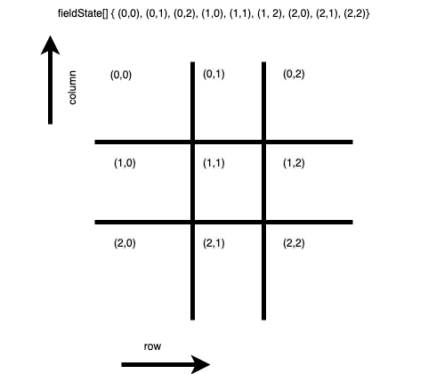

# Notes

## Game rules
[x] a game has nine fields in a 3x3 grid

[x] a player can take a field if not already taken

[x] a game is over when all fields in a row or column are taken by a player

- there are two players in the game (X and O)
- players take turns taking fields until the game is over
- a game is over when all fields in a diagonal are taken by a player
- a game is over when all fields are taken
- a game is over when all fields in a column are taken by a player
